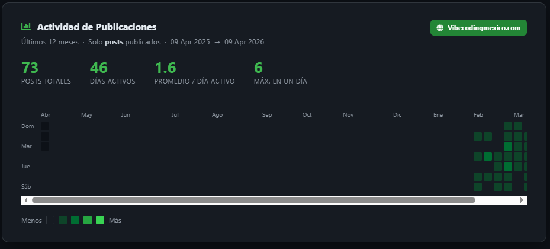

# vibecodingHeatmaps de Wordpress (Abre 2026)
### Comparativa de Vibe Coding en ejericico siemple.

Este es uno de los experimentos semanales que realizo en vibecodingmexico.com  

Este repositorio es el resultado de un experimento de vibecoding **Enfocado a empresas medianas LATAM 2026** realizado el 4 de febrero de 2026. La misión: crear un heatmap de wordpress.
##PROMPT PROPORCIONADO
>INICIA PROMPT

>Actúa como un desarrollador experto en PHP y WordPress. Tu tarea es escribir un script único siguiendo estas especificaciones técnicas estrictas:

>1. Arquitectura y Estilo:

>Lenguaje: PHP 8.x en estilo procedural (evitar clases o estructuras complejas).

>Framework CSS: Bootstrap 4.6.2 (vía jsDelivr).

>Iconos: FontAwesome 5.15.4 (vía jsDelivr).

>Integración: El script debe ejecutarse dentro del entorno de WordPress (usando la conexión $wpdb global), pero debe ser un archivo .php independiente que se pueda colocar en la raíz o en una carpeta del tema.

>2. Requisitos de la Interfaz (UI):

>Header Fijo: Debe mostrar el nombre del modelo de IA que generó el código (usa un marcador de posición como [INSERTAR MODELO AQUÍ]) y el nombre del dominio actual de forma dinámica.

>Footer Fijo: Debe mostrar la versión de PHP activa en el servidor. Si te es posible detcta versión de Wordpress.

>Cuerpo: Una tarjeta (card) central que contenga un Mapa de Calor (Heatmap) al estilo de las contribuciones de GitHub.

>3. Lógica del Mapa de Calor:

>* Debe mostrar los últimos 12 meses.
>* Debe contabilizar únicamente Posts publicados (excluir páginas y otros post types).
>* La intensidad del color debe variar según la cantidad de posts publicados por día.
>* Debe ser visible para cualquier visitante (sin requerir permisos de administrador).
>
>4. Entrega:
>
>Proporciona el código en un solo bloque.
>
>Asegúrate de que los CDN de JS y CSS estén correctamente implementados en el <head> y antes del cierre del </body>.
>
>FIN PROMPT

## ✍️ Resultados
* Ganador Empate Claude, es la imagen del repositorio 9.0
* Ganador Empate Deepseek. EXCELENTE. 9.0
* Qwen Segundo lugar 8.5 Muy limpio pero no dice cuantos son en la barra. Se puede adaptar y es libre.
* Gemini Tercer lugar 8.4 Limpio pero confiuso, sin embargo ser►1a el que usara si no usara a Claude
* Kimi: 8.0 Excelente pero no se siente smooth. Se siente raro al usarlo.
* Grok: 7.0 Falla en diseño, minimalista, es al momento su peior resultado.
* Copilot 0 - No funciona

## ⚖️ Sobre la Licencia
He elegido la **Licencia MIT** por su simplicidad. Es lo más cercano a una "Creative Commons" para código: haz lo que quieras con él, solo mantén el crédito del autor. 
 
## ✍️ Acerca del Autor
Este proyecto forma parte de una serie de artículos en **[vibecodingmexico.com](https://vibecodingmexico.com)**. Mi enfoque no es la programación de laboratorio, sino la **Programación Real**: aquella que sobrevive a servidores compartidos, bloqueos de oficina y conexiones de una sola rayita de señal.

Mi nombre es Alfonso Orozco Aguilar, soy mexicano, programo desde 1991 para comer, y no tengo cuenta de Linkedin para disminuir superficie de ataque. Llevo trabajando desde que tengo memoria como devops / programador senior, y en 2026 estoy por terminar la licenciatura de contaduria. En el sitio esta mi perfil de facebook.

[Perfil de Facebook de Alfonso Orozco Aguilar](https://www.facebook.com/alfonso.orozcoaguilar)

## 🛠️ ¿Por qué cPanel y PHP?
Elegimos **cPanel** porque es el estándar de la industria desde hace 25 años y el ambiente más fácil de replicar para cualquier profesional. 
* **Versión de PHP:** Asumimos un entorno moderno de **PHP 8.4**, pero por su naturaleza procedural, el código es confiable en cualquier hospedaje compartido con **PHP 7.x** o superior. Tu respaldo es como un "Tupperware" que puedes cambiar de refrigerador sin problemas.

---
Proyecto de Vibecodingmexico.com, ver el experimento y el prompt en 
https://vibecodingmexico.com/gestor-de-carpeta-descargas/

## 🚀 Requisitos Mínimos
1. Un dominio y hospedaje php 7.x Hospedaje compartido con PHP 7.x o superior y acceso a MySQL/MariaDB.
